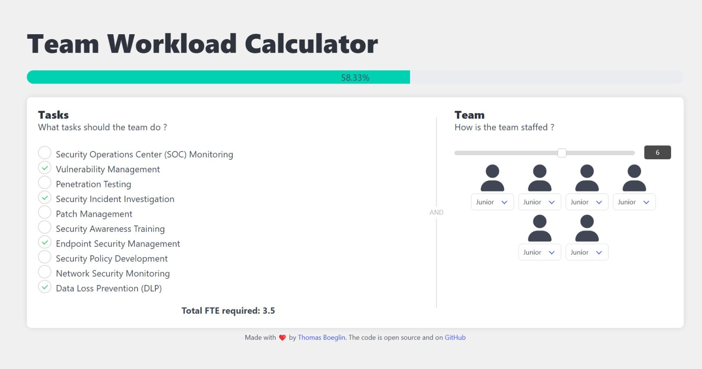
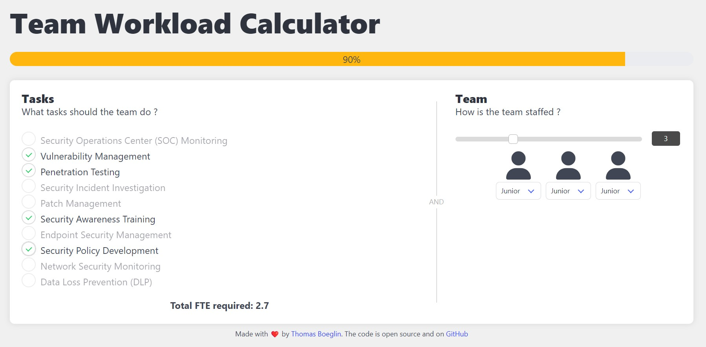

# Team Workload Calculator

## Description

Efficiently manage and allocate team tasks based on FTE requirements with the **Team Workload Calculator**. Use this web app to dynamically add tasks, adjust team size, and visualize workload capacity. Ideal for project managers and team leads looking to optimize team productivity.

## Features

- Dynamic task list with tooltips explaining each task.
- Adjustable team size and composition via a slider.
- Real-time calculation of total FTE required.
- Visual progress bar indicating workload utilization.
- Responsive design using Bulma CSS framework.

## Demo

Check out the live demo: [Team Workload Calculator](https://thomasboegl1.github.io/Team-Workload-calculator/)

## Screenshots




## Installation

1. Clone the repository:
   
   ```bash
   git clone https://github.com/thomasboegl1/Team-Workload-calculator.git
   cd team-workload-calculator
   ```

2. Open `index.html` in your web browser to start using the application.

## Usage

1. Open `task.json` in your preferred code editor.
2. Edit the task list to meet your needs.
3. Open `index.html`.
4. Add tasks by selecting the checkboxes in the "Tasks" section.
5. Adjust the team size using the slider in the "Team" section.
6. View the total FTE required and the progress bar to ensure team capacity is not exceeded.

## Contributing

Contributions are welcome!  Feel free to open a PR!

## License

This project is licensed under the GPLv3 License. See the [LICENSE](LICENSE) file for details.

## Contact

For any questions or feedback, please contact:

- Thomas Boeglin - [website](https://boeglin.xyz)
